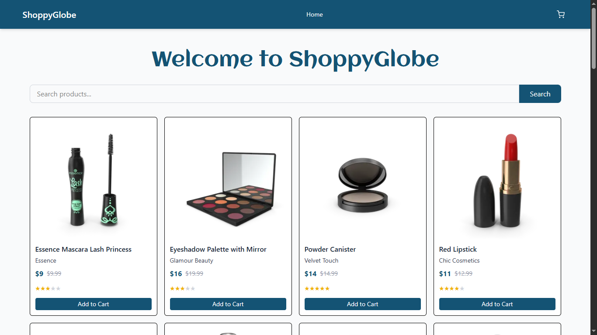
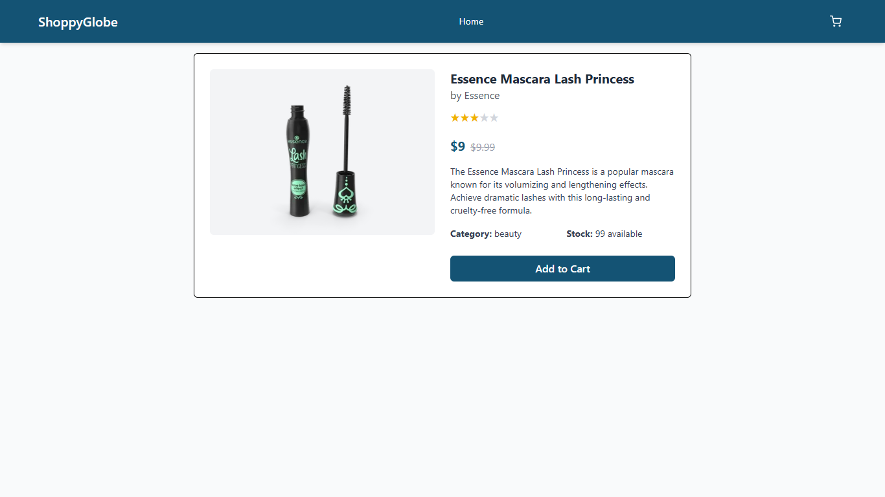
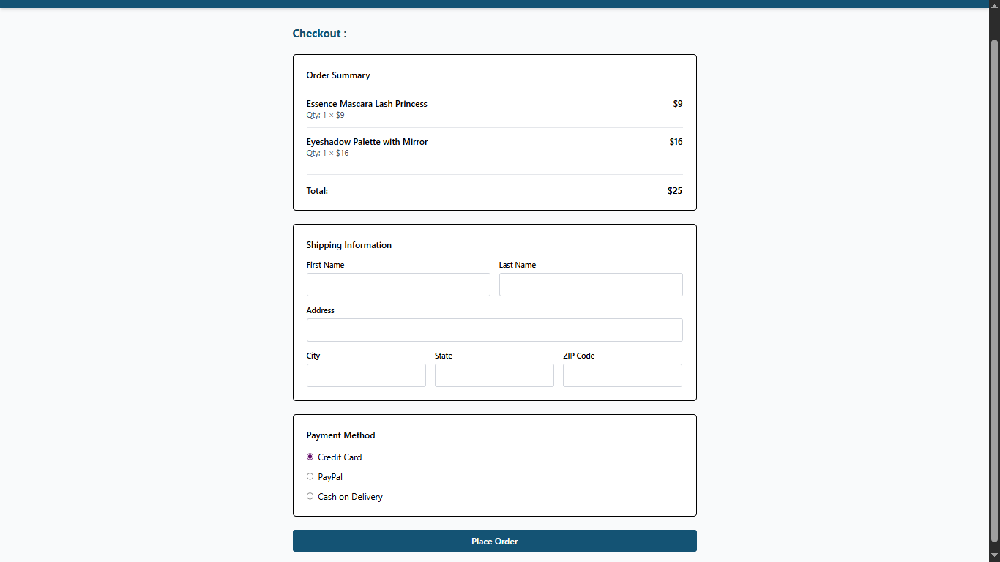
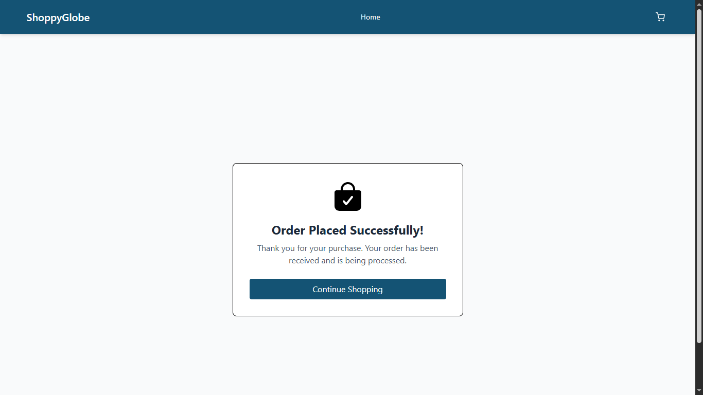
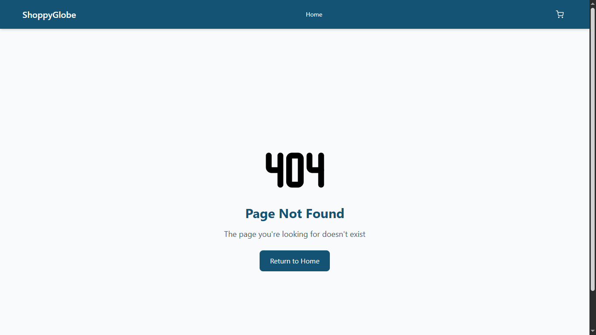

# 🛒 ShoppyGlobe (React + Redux + Tailwind CSS)

A simple and functional **E-commerce Store** built using **React**, **Vite**, **Tailwind CSS**, and **Redux Toolkit**. It allows users to browse products, view details, add them to the cart, and place orders within a clean, beginner-friendly UI.

---

# 🖼️ Project Preview :
## 🏠 Homepage 


---

## 🛍️ Product Listing


---

## 🛒 Cart


---

## 💳 Checkout


---

## ✅ Order Placed


---

## ❌ Error Page


---

## 🚀 Features

- View all products
- Search products by name or brand
- View detailed product information
- Add products to cart
- Increase or decrease quantity in cart
- Checkout with order summary and shipping info
- Place order confirmation page
- Error (404) page for invalid routes
- Redux Toolkit for state management
- Tailwind CSS for responsive styling

---

## 🛠️ Tech Stack

- [React](https://reactjs.org/)
- [Vite](https://vitejs.dev/)
- [Tailwind CSS](https://tailwindcss.com/)
- [Redux Toolkit](https://redux-toolkit.js.org/)
- [React Router](https://reactrouter.com/)
- [React Toastify](https://fkhadra.github.io/react-toastify/) (notifications)
- [DummyJSON API](https://dummyjson.com/) (for product data)

---

## 📁 Folder Structure

```
📦shoppyglobe
 ┣ 📂node_modules/
 ┣ 📂public/
 ┣ 📂src/
 ┃ ┣ 📂components/
 ┃ ┃ ┣ 📄Cart.jsx
 ┃ ┃ ┣ 📄CartItem.jsx
 ┃ ┃ ┣ 📄Checkout.jsx
 ┃ ┃ ┣ 📄Header.jsx
 ┃ ┃ ┣ 📄Home.jsx
 ┃ ┃ ┣ 📄LoadingSpinner.jsx
 ┃ ┃ ┣ 📄NotFound.jsx
 ┃ ┃ ┣ 📄OrderPlaced.jsx
 ┃ ┃ ┣ 📄ProductDetail.jsx
 ┃ ┃ ┣ 📄ProductItem.jsx
 ┃ ┃ ┗ 📄ProductList.jsx
 ┃ ┣ 📂redux/
 ┃ ┃ ┣ 📂slices/
 ┃ ┃ ┃ ┣ 📄cartSlice.js
 ┃ ┃ ┃ ┗ 📄productFilterSlice.js
 ┃ ┃ ┗ 📄store.js
 ┃ ┣ 📂hooks/
 ┃ ┃ ┗ 📄useFetch.js
 ┃ ┣ 📄App.jsx
 ┃ ┣ 📄App.css
 ┃ ┣ 📄main.jsx
 ┃ ┣ 📄index.css
 ┃ ┗ 📄vite.config.js
 ┣ 📄.gitignore
 ┣ 📄package.json
 ┣ 📄package-lock.json
```

---

## 💻 How to Run Locally

1. **Clone the repo**
```bash
git clone https://github.com/RohitPalekar/ShoppyGlobe.git
cd shoppyglobe
```

2. **Install dependencies**
```bash
npm install
```

3. **Run the dev server**
```bash
npm run dev
```

4. Visit: [http://localhost:5173](http://localhost:5173)

---

## 🧠 Tips

- Click any product to view details.
- Use the cart icon in the header to view cart items.
- Increase or decrease quantities directly in the cart.
- Complete checkout to see order confirmation.
- Try searching by product name or brand on the homepage.
- Visit invalid URLs to trigger the custom 404 page.

---
